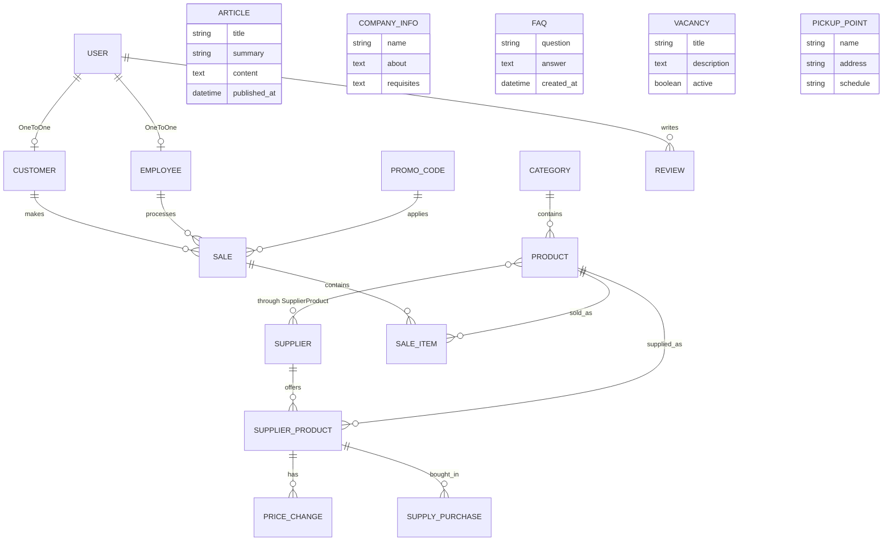

# ER-диаграмма зоомагазина

```mermaid
erDiagram
    USER ||--o| CUSTOMER : "OneToOne"
    USER ||--o| EMPLOYEE : "OneToOne"
    CATEGORY ||--o{ PRODUCT : contains
    PRODUCT }o--o{ SUPPLIER : "through SupplierProduct"
    SUPPLIER ||--o{ SUPPLIER_PRODUCT : offers
    PRODUCT ||--o{ SUPPLIER_PRODUCT : supplied_as
    SUPPLIER_PRODUCT ||--o{ PRICE_CHANGE : has
    SUPPLIER_PRODUCT ||--o{ SUPPLY_PURCHASE : bought_in
    CUSTOMER ||--o{ SALE : makes
    EMPLOYEE ||--o{ SALE : processes
    PROMO_CODE ||--o{ SALE : applies
    SALE ||--o{ SALE_ITEM : contains
    PRODUCT ||--o{ SALE_ITEM : sold_as
    USER ||--o{ REVIEW : writes

    ARTICLE {
        string title
        string summary
        text content
        datetime published_at
    }
    COMPANY_INFO {
        string name
        text about
        text requisites
    }
    FAQ {
        string question
        text answer
        datetime created_at
    }
    VACANCY {
        string title
        text description
        boolean active
    }
    PICKUP_POINT {
        string name
        string address
        string schedule
    }
```
